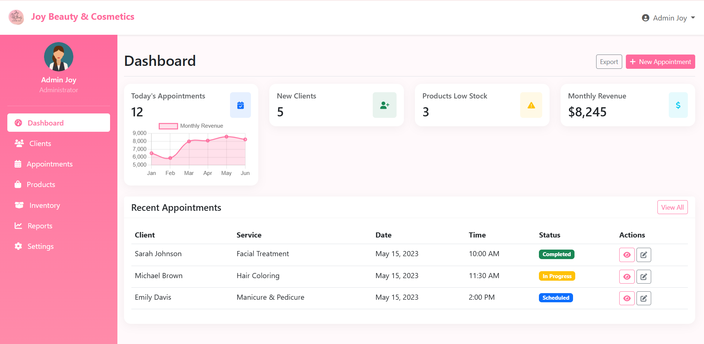
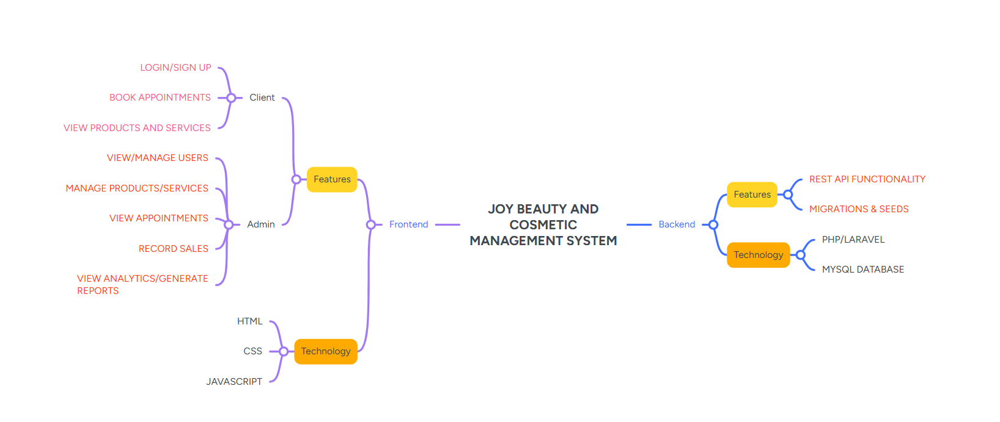

# Joy Beauty and Cosmetic Management System

## Overview
The Joy Beauty and Cosmetic Management System is a comprehensive solution designed to modernize operations for beauty businesses. This web-based application streamlines appointment scheduling, inventory management, sales tracking, and customer relationship management for Joy Beauty And Cosmetic, a growing business in Meru Town.

## Key Features

### For Business Owners:
- Real-time inventory tracking to prevent stockouts or overstocking
- Automated sales reporting and business analytics
- Comprehensive financial tracking across multiple payment methods

### For Employees:
- Intuitive appointment scheduling system
- Simplified sales processing with digital receipts
- Reduced manual record-keeping tasks

### For Customers:
- Convenient online booking system
- Personalized service history tracking
- Multiple payment options (cash, mobile money, credit cards)

## Technical Implementation

### Frontend:
- Built with HTML, CSS, and JavaScript
- Responsive design for various devices
- Intuitive user interface

### Backend:
- PHP/Laravel framework
- MySQL database
- REST API architecture
- Migration and seeding capabilities

## Project Background
Joy Beauty And Cosmetic has been operating since 2017 but faced challenges with manual processes including inventory management, appointment scheduling, and customer data tracking. This system addresses these pain points by digitizing operations and providing real-time business insights.

## Screenshots
- **System Mindmap**: [Insert mindmap image after uploading]
- **Dashboard Preview**: [Insert dashboard screenshot after uploading]

## Getting Started
[More Installation and setup instructions will be added during implementation phase]
### Login Credentials

**Admin Account:**
- Email: `admin@joybeauty.com`
- Password: `admin123`

**Client Account:**
- Email: `client@gmail.com`,`sarah12@gmail.com`
- Password: `client123`,

### Account Management

- **Client Accounts**: New client accounts can be created through the registration system on the website
- **Admin Accounts**: Admin accounts must be created directly in the database with `user_type` set to `'admin'`

### Quick Setup

1. Ensure your web server and MySQL are running
2. Place the project files in your web directory
3. Configure your database settings in the `.env` file
4. The database will be automatically created and populated on first run
5. Access the application through your web browser
6. Use the login credentials above to access admin or client dashboards

## Future Enhancements
- Loyalty program integration
- Mobile app development
- Advanced analytics with predictive insights

This system represents a significant step forward in helping beauty businesses transition from paper-based operations to efficient digital management.